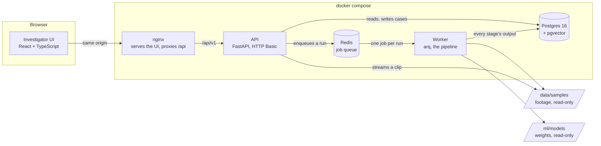
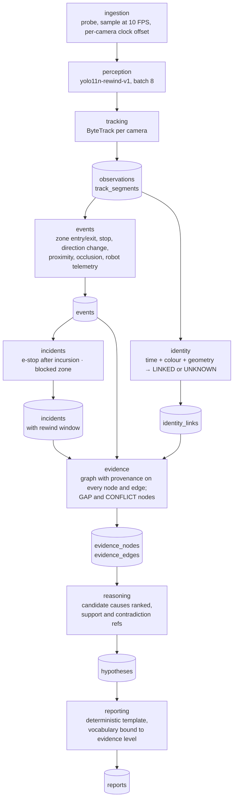
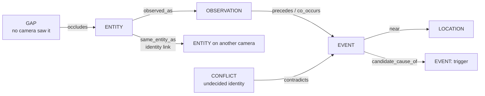

# Architecture

How REWIND is put together, as built. The decisions behind it are ADRs; this page is
the map. Diagrams are Mermaid, rendered by GitHub.

## 1. Shape

A **modular monolith** (`ADR-0001`): one Python codebase, one API process, one worker
process, Postgres, Redis, and a React UI, all under Docker Compose. Modules under
`services/` own one pipeline stage each and communicate only through the frozen
contracts in `packages/schemas/` and the database. There is no event bus
(`ADR-0010`).



Only the UI's port is published. The API is reached through nginx, which is what lets
the browser's HTTP Basic credentials cover `<video>` requests (`ADR-0009`). Footage
never enters the database: a run records where its clips are (`ADR-0006`) and the API
streams them from there.

## 2. The pipeline, stage by stage

A run is the unit of work. `POST /cases` records it and enqueues one job; the worker
runs every stage in order, in one process, committing after each, and every stage
after perception reads the previous stage's rows from Postgres rather than its
in-memory output (spec §11). The stage timers on the run are what `/metrics` reports.



| Stage | Module | Version stamped on output | Measured in |
|---|---|---|---|
| Ingestion | `services/ingestion` | — | EXP-0012 |
| Detection | `services/perception` | `yolo11n-rewind-v1:native:conf0.25:iou0.5:edge16` | EXP-0001, 0003, model card |
| Tracking | `services/tracking` | `bytetrack:buf30:match0.9:fps10` | EXP-0002, 0004 |
| Events | `services/events` | — | EXP-0005, 0006 |
| Identity | `services/identity` | `assoc:thr0.75:amb0.1:w0.35/0.4/0.25:gap15.0` | EXP-0007 |
| Incidents | `services/incidents` | `incidents:estop10/10:dwell20+10/10:zonesZ2` | EXP-0008 |
| Evidence graph | `services/evidence` | `evidence-0.1.0`, `uncertainty-0.1.0` | EXP-0009 |
| Hypotheses | `services/reasoning` | `hypotheses:tau5:look10:w0.35/0.3/0.2/0.15:strong0.7` | EXP-0009 |
| Report | `services/reporting` | `deterministic-0.3.0` | EXP-0009, 0011 |

Every version string is recorded on the run, so a report can be traced to exactly
what produced it.

## 3. The evidence model

The spine is `EvidenceLevel`: `confirmed`, `strongly_inferred`, `possible`,
`conflicting`, `unknown`. It is carried by every claim, every hypothesis and every
graph node, and the **phrasing a report may use is derived from it**, not chosen:
"Observed", "Likely contributed", "Possible", "Conflicting evidence", "Cannot
determine". A claim at any level above `unknown` with no `evidence_refs` fails
validation in the contract itself; the generator cannot emit one.



Node types: entity, observation, event, location, interval, **gap**, **conflict**.
Gaps and conflicts are nodes, not error states: they render in the UI with their own
visual encoding (`docs/ui/design-tokens.md`) and become *Cannot determine* claims in
the report. Every node and edge carries `provenance` pointing at a stored row.

## 4. One request, end to end

```mermaid
sequenceDiagram
    actor I as Investigator
    participant UI
    participant API
    participant Q as Redis
    participant W as Worker
    participant DB as Postgres

    I->>UI: sign in (HTTP Basic), open inbox
    I->>API: POST /cases {case_ref, dataset_version}
    API->>DB: run = hash(inputs) + versions (idempotent)
    API->>Q: enqueue(run_id)
    API-->>I: 202 {run_id, queued}
    Q->>W: job
    W->>W: RUNNING; perception per camera
    W->>DB: observations, segments
    W->>DB: events, links, incident + rewind window
    W->>DB: graph, hypotheses, report
    W->>DB: COMPLETE, frames, stages_s, peak_memory_mb
    I->>UI: open the case
    UI->>API: GET /cases/{id}, /timeline, /evidence, /report, /replay
    API->>DB: evidence_access_log row per evidence read
    UI->>API: GET /media/{camera} (investigator only)
    API-->>UI: clip, by range
```

## 5. Contracts and schema authority

```
frozen Pydantic contract → SQLAlchemy model → Alembic migration → database
```

`packages/schemas/` is frozen; `SCHEMA_VERSION` is `1.2.0` after two additive bumps
(`ADR-0006` media on the run, `ADR-0008` cost on the run). Golden fixtures for every
boundary live in `tests/fixtures/golden/` and are regenerated by
`scripts/dataset/make_golden_fixtures.py`; the mock API serves them, and the UI was
built against the mock from Week 4. `openapi.json` is committed and CI fails if the
app's contract differs from it.

## 6. Where things run

| Component | Development | Compose stack | Hosted target |
|---|---|---|---|
| Database | any Postgres 16 + pgvector via `DATABASE_URL` | `pgvector/pgvector:pg16` (`ADR-0007`) | Supabase, session pooler (`ADR-0003`) |
| Queue | `make up` Redis | `redis:7` | Redis |
| Worker | host, MPS on Apple silicon, ~10 s a case | container, CPU, ~90 s a case | either |
| API | `make api` | `python -m apps.api`, JSON logs | same image |
| UI | Vite dev server, proxies `/api` | nginx, static bundle | same image |

Numbers and hardware are in `docs/09-deployment.md`; throughput in EXP-0012.

## 7. What is deliberately not here

Face recognition · live RTSP ingestion · Kafka or any bus (`ADR-0010`) · a graph
database (`ADR-0005`) · training a detector from scratch (`ADR-0004`) · user
management beyond two roles (`ADR-0009`) · an LLM anywhere in the reporting path. The
charter (`docs/00-project-charter.md` §4) is the list; the ADRs are the reasons.

## Related

`ADR-0001` · `ADR-0005` · `ADR-0006` · `ADR-0007` · `ADR-0009` · `ADR-0010` ·
`docs/06-ml-design.md` · `docs/09-deployment.md` · `docs/10-security-and-privacy.md` ·
`packages/schemas/README.md` · `openapi.json`.
