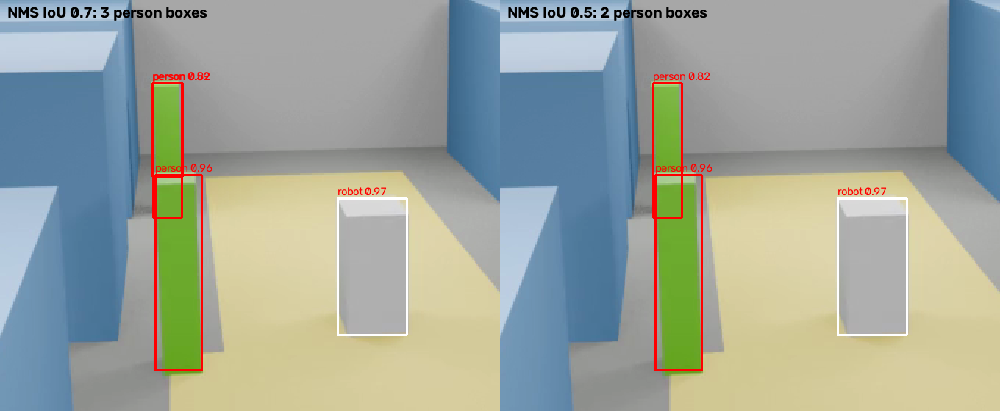

# Gate 1 — video reliably becomes timestamped observations

- **Sub-phase:** E3.4
- **Date reviewed:** 2026-09-11 (calendar date: Tue 03 Nov 2026 — reached early)
- **Verdict:** PASS, with two named carry-forwards and one calibration awaiting sign-off

## Exit criteria

| Criterion | Measured | Provisional floor | Source |
|---|---|---|---|
| Detection recall, person | 0.994 | ≥ 0.90 | `detection-finetuned-case_05` |
| Detection recall, robot | 0.992 | ≥ 0.90 | same |
| Detection precision, person | 0.987 | ≥ 0.85 | same |
| Detection precision, robot | 0.997 | ≥ 0.85 | same |
| Id switches per camera per case | worst 1, total 2 over 12 camera-cases | ≤ 2 | EXP-0004 |
| Observation window query | 1–6 ms local, 45–207 ms Supabase | < 500 ms | `docs/09-deployment.md` |
| Throughput, end to end | ~21 s per 3-camera, 45 s case on MPS | envelope: 720p, 10 FPS | worker burst run |

Every number is on `case_05`, the validation case, or on the four tune cases. The
golden `case_02` and `case_06` are unopened.

## Contract integrity

`SCHEMA_VERSION` is still `1.0.0`. `openapi.json` drift check passes. No Pydantic
contract was edited during E3; `Observation`, `TrackSegment` and `ProcessingRun` are
what the pipeline emits, unchanged from Week 1.

## Fixture parity

The pipeline's real output is built from the contract classes directly, so it cannot
diverge in shape. `tests/integration/test_pipeline.py` writes real observations and
segments through the same persistence path the golden fixtures validate against.
`make validate-gt` passes on the re-rendered ground truth.

## Test coverage

| Area | Tests |
|---|---|
| Tracker identity stability, gaps, config | `tests/unit/test_tracking.py` (9) |
| Persistence, window queries, idempotent writes | `tests/integration/test_persistence.py` (5) |
| Pipeline end to end on real video | `tests/integration/test_pipeline.py` (5) |
| Alignment guard accepts shading, rejects background | `tests/unit/test_verify_alignment.py` (3) |
| Worker recognises the fine-tuned checkpoint | `tests/unit/test_worker_settings.py` (2) |
| Geometry primitives (E4.1, pulled forward) | `tests/unit/test_geometry.py` (9) |

Total suite: 217. Nothing deferred from this phase.

## Documentation

- ADR-0004 (fine-tuning in scope), amended 2026-09-10 for the zero-shot floor.
- EXP-0001 zero-shot, EXP-0002 tracker on perfect boxes, EXP-0003 fine-tune,
  EXP-0004 tracker on real boxes.
- Model card `artifacts/model-cards/yolo11n-rewind-v1.md`, with unmeasured classes
  marked as such.

## Failure cases

**Duplicate detection of a partially occluded person.** For 22 s of `case_03`, P01
stands in front of P02 as seen from CAM_A. The detector produced both the visible part
of P02 and its full extent, at IoU ~0.65 between them, and Ultralytics' default NMS
of 0.7 kept both. The phantom box seeded short-lived tracks and made the scorer see
switches that the primary track never had.

Fixed by NMS 0.5 (EXP-0004). Root cause is a COCO-tuned default meeting a scene where
one object detected twice is likelier than two objects at that overlap.

**Long-gap re-acquisition.** `case_01 CAM_A` P01 crosses the walkway unseen for 7.9 s
and returns as a new track. A Kalman prediction drifts too far in that time for a
box-only tracker to re-match. Not fixable in E3; it is what E5's appearance features
are for. Carried forward.

**Forklift and its load are one track.** `case_06 CAM_A` (EXP-0002): a pallet on a
forklift is geometrically one moving object. Recorded as a limitation, not tuned away.

## Bugs this phase found in earlier phases

| Bug | Phase | Found by |
|---|---|---|
| Actors keyframed only under `--save-blend`; all 18 clips had frozen actors | E1.2 | Fine-tune scoring 0.083 mAP → `verify_alignment.py` written as a guard |
| Alignment guard failed correct renders on strongly shaded faces | E1.2 guard | First correct render; fixed by matching hue |
| Worker tested the checkpoint *filename* for `rewind`, so `best.pt` was routed through the COCO map and lost three classes | E3.3 worker | EXP-0004 showing no robots |

## Charter alignment

No scope added. Fine-tuning was brought into scope by ADR-0004 before any training
code was written. The E4.1 geometry module was pulled forward while the render ran,
which the roadmap explicitly allows; no E4.2 work started.

## Re-measured 2026-09-13 — per-actor colour render

Scene spec §5 asks for a distinct vest colour per actor; the first render gave every
actor its class colour, so P01 and P02 were pixel-identical. Fixed, re-rendered,
retrained with the same recipe (EXP-0003), and every harness re-run (ledger, `BUG-FIX`).

| Criterion | 2026-09-11 | 2026-09-13 | Floor |
|---|---|---|---|
| Detection recall, person | 0.994 | 0.989 | ≥ 0.90 |
| Detection recall, robot | 0.992 | 0.989 | ≥ 0.90 |
| Detection precision, person | 0.987 | 0.991 | ≥ 0.85 |
| Detection precision, robot | 0.997 | 1.000 | ≥ 0.85 |
| Id switches per camera per case | worst 1, total 2 | **worst 1, total 1** | ≤ 2 |

The retrained checkpoint first scored **5 switches, 4 on `case_03 CAM_B`**, which
fails this gate. Cause: P02 rises into CAM_B from the bottom edge and the new
detector reported it as 4 px, then 13 px slivers, each too different from the last
for ByteTrack to match. Fixed in the detector, not the tracker: edge-cut boxes under
16 px are dropped (`DetectorConfig.edge_min_side_px`, EXP-0004 re-run). Detection
precision and recall are identical with and without the rule.

Two more bugs this re-run found:

| Bug | Phase | Found by |
|---|---|---|
| Every actor rendered in its class colour; P01 and P02 indistinguishable, contrary to scene spec §5 | E1.2 | E5.2 appearance descriptors had nothing to separate |
| Alignment guard demanded 35% of a box match regardless of occlusion; a shared class colour had let the occluder's pixels pass for the hidden actor's | E1.2 guard | First per-actor render: P02 at visibility 0.18 behind P01 |

Verdict unchanged: **PASS**, on better tracking than the original review.

## Calibrated thresholds — proposed, awaiting sign-off

Charter §6 says the provisional floors are replaced here with values calibrated to the
measured baseline. Proposed:

| Metric | Provisional | Proposed | Why |
|---|---|---|---|
| Detection recall (person, robot) | ≥ 0.90 | ≥ 0.95 | Measured 0.99; a 0.90 floor would not catch a regression of half the margin |
| Detection precision | ≥ 0.85 | ≥ 0.95 | Measured 0.99; same reasoning |
| Id switches per case per camera | ≤ 2 | ≤ 2 | Measured worst 1; the two remaining are the long-gap kind, and E5 may or may not close them. Keep. |

Not proposed for forklift/pallet: no held-out measurement exists. Their floor is set
at E9.1.

## Honest verdict

Genuinely passed for person and robot on synthetic primitives, on a validation case
that also selected the checkpoint. The gate says nothing about real footage, about
forklift/pallet on unseen cases, or about long-gap identity — and each of those is
written down above with the phase that owns it.

## Carry-forwards

1. Long-gap re-acquisition → E5.2/E5.3.
2. Forklift/pallet held-out measurement → E9.1.
3. ~~`yolo11n.pt` blob in history at `375a586` → scrub before the Week 20 public flip.~~
   Done 2026-09-13 with `git filter-repo`; every earlier commit hash changed (ledger).
